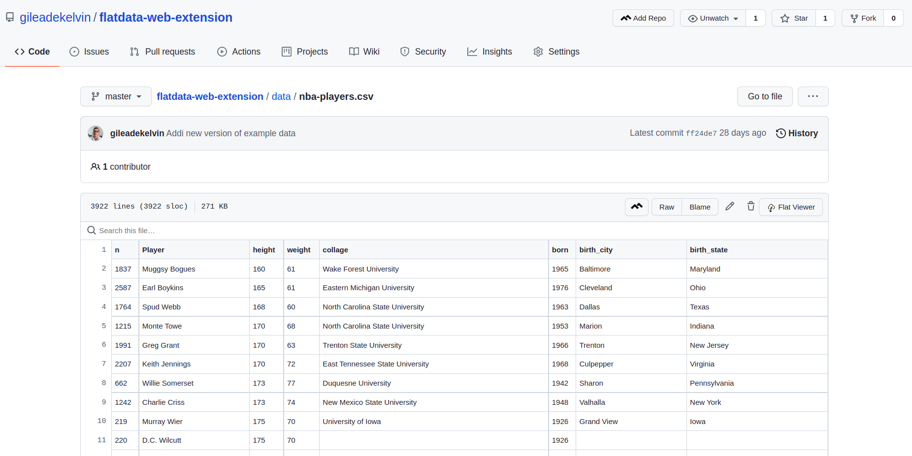

# Flatdata Viewer web extension (unofficial test)

### A web extension for Chrome which adds a icon on github for opening the file on FlatData Viewer.

 

[Flatdata](https://octo.github.com/projects/flat-data) is a project developed by github developers looking to automate data transformation processes. One of the tools available is the Flatdata Viewer, which is an interface designed to visualize data files (.csv, .json) in a more intuitive way and with greater power. 

This extension is aiming to add a button on the page of a file in github to redirect the user to the Flatdata Viewer to explore the file with all the power they have.

You don't need to type the repository on Flatdata form, just click the button and enjoy!

The button is added next to the delete icon.

To visualize more examples of data access https://github.com/the-pudding/data

## How to install

0. Clone this repository

1. Go to chrome://extensions/

2. Check the box for Developer mode in the top right

3. Click Load Unpacked (top left)

4. Select the repo folder location

## How to Contribute

You are free to contribute with this extension.

To do this:

1. Create a fork for this repository
2. Make the changes that you want
3. Open the PR and assigne @gileadekelvin

Visit our issue's page to discuss about bugs and new features!
